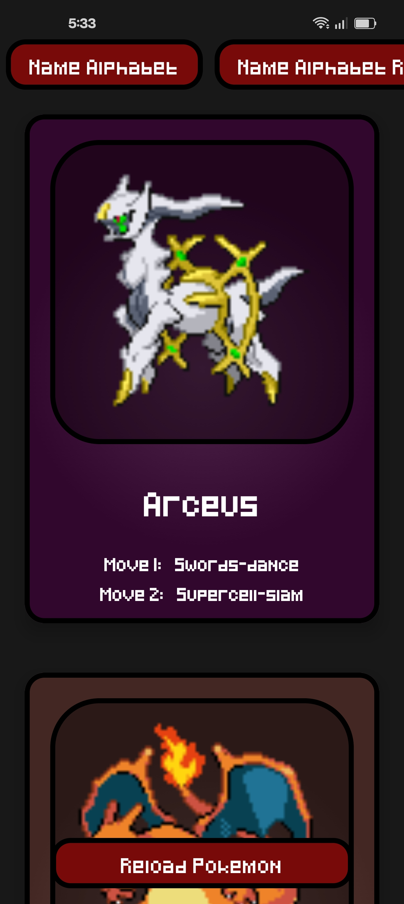

# Compose Pokedex

An Android application built with Kotlin and Jetpack Compose that interacts with the [PokeAPI](https://pokeapi.co/) to fetch and display Pokémon data.

## 📸 Screenshot

  

## 🚀 Tech Stack

- **Kotlin** - 100% Kotlin codebase.
- **Jetpack Compose** - Modern declarative UI toolkit for Android.
- **Retrofit** - Type-safe REST client for API requests.
- **Moshi** - JSON serialization/deserialization.
- **Coil** - Image loading and caching library.
- **MVVM Architecture** - Separation of concerns using ViewModel.

## 🛠️ Build and Run

1. Clone the repository to your local machine.
2. Open the project in **Android Studio**.
3. Sync the Gradle files.
4. Run the app on an Android emulator or physical device (Min SDK 24).
